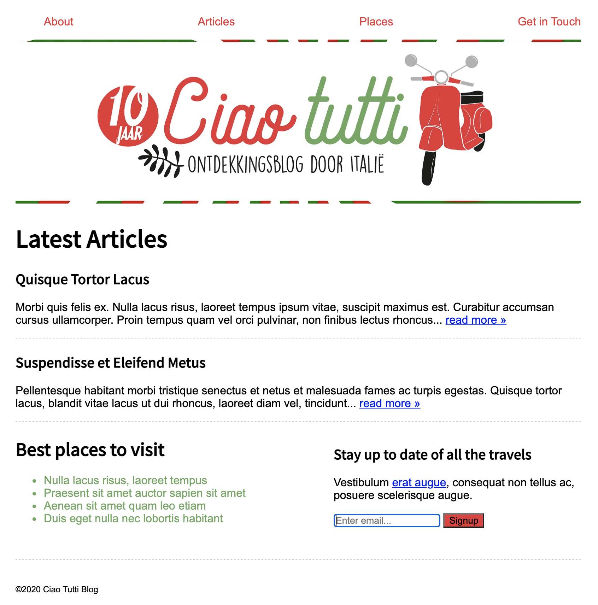

# Opdrachtbeschrijving

## Opdracht 1 - CSS Selectors

De styling van de webpagina Ciao Tutti in `index.html` (map `/opdracht-1`) is nog niet helemaal af! Gebruik het CSS bestand `styles.css` (in dezelfde map) om de styling af te maken. In dat bestand staat (in commentaar) precies wat er moet gebeuren.

### Aandachtspunten
* Denk eraan dat je alleen iets in het HTML-bestand mag veranderen als dit uitdrukkelijk in de opdrachtbeschrijving staat!
* Je hoeft zelf geen nieuwe bestanden aan te maken. Het `styles.css` bestand in de map `opdracht-1` is al gekoppeld aan het HTML bestand
* Aan het CSS bestand in de map `/base` mag je niets veranderen!

### Eindresultaat

## Opdracht 2 - Flexbox

Ook de styling voor de elementen in `index.html` (map `/opdracht-2`) is ook nog niet helemaal af. Er is namelijk nog helemaal geen flexbox toegepast! Bekijk de HTML eens goed en gebruik het CSS bestand `styles.css` (in dezelfde map) om de elementen er net zo uit te laten zien als het eindresultaat hieronder.

### Aandachtspunten

In `index.html` vindt je de HTML voor de opdracht. Denk eraan:
* Denk eraan dat je niets in het HTML-bestand mag veranderen, behalve het toevoegen van een `class` of `id`-attribuut waar nodig.
* Alle `div`-tags in het HTML-bestand hebben een class-naam die overeenkomt met het opdrachtnummer. Deze mag je niet aanpassen.
* Je kunt voor het gemak de andere HTML-elementen uit-commentariëren als je met een specifieke opdracht bezig bent.
* Je hoeft zelf geen nieuwe bestanden aan te maken. Het `styles.css` bestand in de map `opdracht-2` is al gekoppeld aan het HTML bestand
* Aan het CSS bestand in de map `/base` mag je niets veranderen!
* Houd er rekening mee dat de body `1200px` breed is.
* Houd het cheatsheet van CSS Tricks bij de hand voor alle [Flexbox properties](https://css-tricks.com/snippets/css/a-guide-to-flexbox/).

### Eindresultaat opdracht 2.1:
Zorg dat het paarse review-blok er zo uit komt te zien door flexbox te gebruiken:

### Eindresultaat opdracht 2.2:
Zorg dat de `
` er zo uit komt te zien door flexbox te gebruiken:

### Eindresultaat opdracht 2.3:
Zorg dat de `
` er zo uit komt te zien door flexbox te gebruiken:

### Eindresultaat opdracht 2.4:
Zorg dat het login-blok er zo uit komt te zien door flexbox te gebruiken:

### Eindresultaat opdracht 2.5:
Zorg dat de layout van de gele blokken er zo uit komt te zien door flexbox te gebruiken.
Elk blok heeft een minimale breedte van 1/3 van het originele scherm van 1200px. **Let op:** er zit ook nog padding op.

Als het scherm kleiner wordt, willen we dat de blokken op de volgende regel wrappen zodra ze niet meer passen:

